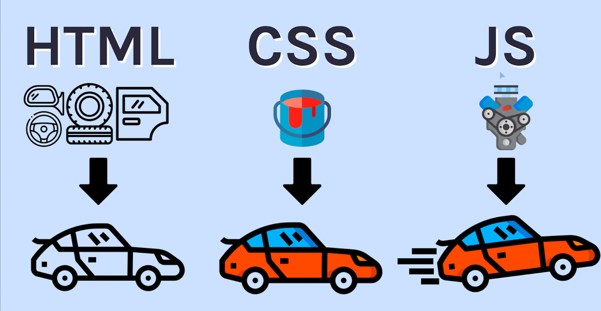

# Introduction
**Learning HTML is crucial for web development** as it forms the structural foundation of web pages. HTML defines the layout and content of a webpage, including headings, paragraphs, images, links, and more. It ensures cross-browser compatibility, aids in SEO, and enables responsive web design. For front-end developers, HTML is a fundamental skill, allowing them to create visual and interactive components and build accessible web content. Overall, **HTML is a fundamental and indispensable skill for anyone involved in web development or content creation**.

HTML stands for **Hypertext Markup Language**, and it is the most widely used language to write Web Pages.

- **Hypertext** refers to the way in which Web pages (HTML documents) are linked together. Thus, the link available on a webpage is called Hypertext.

- As its name suggests, HTML is a **Markup Language** which means you use HTML to simply "mark-up" a text document with tags that tell a Web browser how to structure it to display.

Originally, HTML was developed with the intent of defining the structure of documents like headings, paragraphs, lists, and so forth to facilitate the sharing of scientific information between researchers.

Now, HTML is being widely used to format web pages with the help of different tags available in HTML language.

# Role of HTML, CSS and Javascript in a webpage

HTML, CSS, and JavaScript play distinct and complementary roles in creating and enhancing webpages. Each language serves a specific purpose, and together they form the core foundation of modern web development.

1. **HTML (Hypertext Markup Language)**:
   - Role: HTML provides the **structure and content** of a webpage. It defines the **layout** of elements like headings, paragraphs, images, links, forms, and more. HTML is responsible for organizing information in a logical and readable format.
   - Importance: HTML is the backbone of every webpage, forming the foundation for displaying information and enabling navigation between different sections of the page.

2. **CSS (Cascading Style Sheets)**:
   - Role: CSS is used for **styling** the HTML elements defined in a webpage. It allows developers to control the **presentation and visual appearance** of web content, such as fonts, colors, layout, and spacing.
   - Importance: CSS enhances the aesthetics of a webpage, making it visually appealing and user-friendly. It ensures a consistent and cohesive design across various devices and screen sizes.

3. **JavaScript**:
   - Role: JavaScript is a **programming language** that enables **interactivity and dynamic behavior** on webpages. It allows developers to add features like **animations**, **user interactions**, **form validation**, and **updating content** without page reload.
   - Importance: JavaScript significantly enhances the user experience, making webpages more engaging and interactive. It enables the creation of dynamic web applications and allows developers to respond to user actions in real-time.

Combining HTML, CSS, and JavaScript allows developers to create rich and interactive web experiences. HTML defines the structure and content, CSS styles the presentation, and JavaScript adds functionality and interactivity. Together, these languages form the core of front-end development, making it possible to deliver a seamless and enjoyable user experience on the web.

# How People Access the Web

## Browsers
Web browsers, such as Firefox, Internet Explorer, Safari, Chrome, and Opera, allow people to access websites. Users can view web pages by typing a web address, following links, or using bookmarks. New versions of browsers are regularly released with updated features and support for new language additions. However, not all visitors will be using the latest browser versions, so it's important not to rely on all users having access to the latest functionality across all browsers.

## Screen Readers
Screen readers are software programs used by individuals with visual impairments to read the content of a computer screen aloud. Similar to laws requiring public buildings to be accessible to people with disabilities, there are also regulations mandating that websites be made accessible to ensure inclusivity for all users.

HTML is crucial for browsers as it provides the structure and content of webpages, ensuring cross-browser compatibility and enabling responsive design. For screen readers, HTML's semantic elements and proper usage of alt text make web content accessible to visually impaired users, facilitating navigation and understanding of the page's structure and images.

