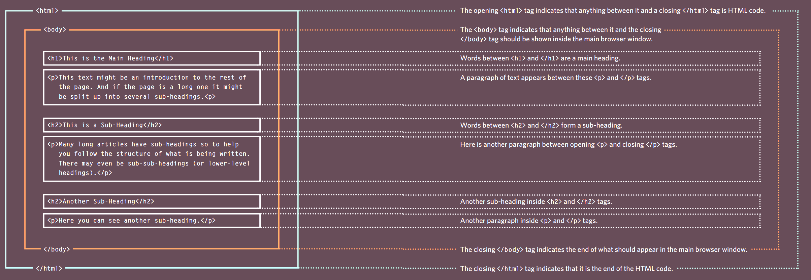
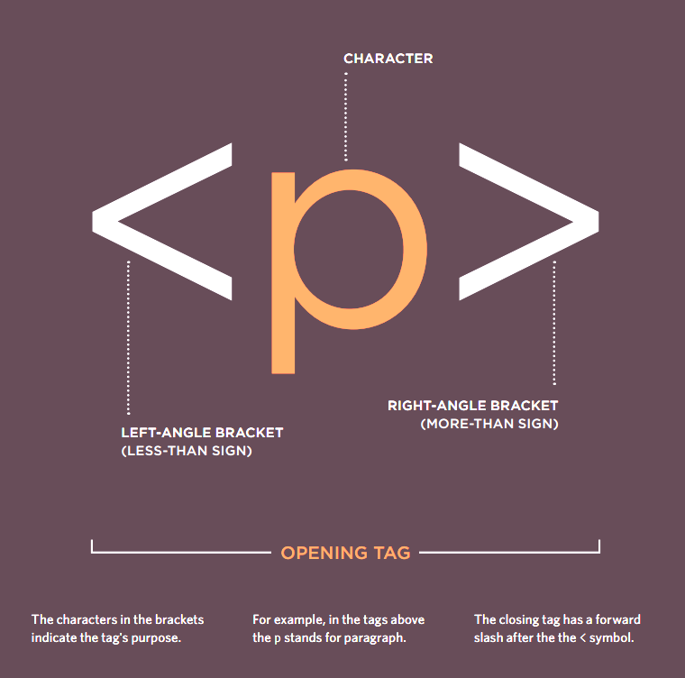
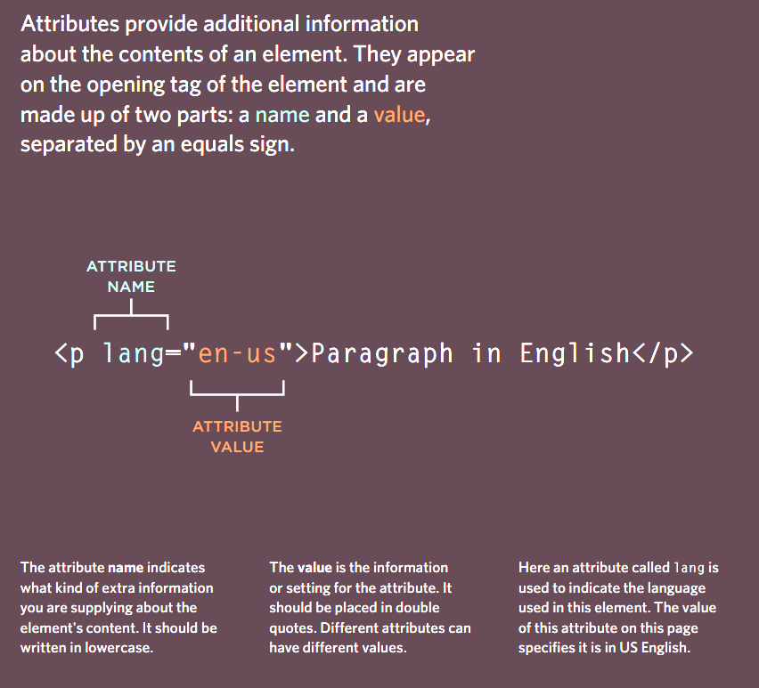
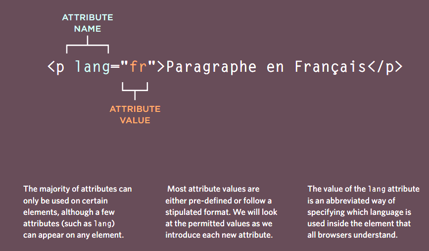

# Introduction to HTML Elements and Tags

You can find a file called "index.html" in this step. Don't worry about the code for now, as it represents the following HTML document:

```html
<!DOCTYPE html>
<html>
  <body>
    <h1>This is the Main Heading</h1>
    <p>
      This text might be an introduction to the rest of the page. And if the page is a long one, it might be split up into several sub-headings.
    </p>
    <h2>This is a Sub-Heading</h2>
    <p>
      Many long articles have sub-headings to help readers follow the structure of the content. There may even be sub-sub-headings (or lower-level
      headings).
    </p>
    <h2>Another Sub-Heading</h2>
    <p>Here you can see another sub-heading.</p>
  </body>
</html>
```

The HTML code consists of characters enclosed in angled brackets, known as HTML elements. Elements usually have two tags: an opening tag and a closing tag (with an extra forward slash). The content between these tags provides information to the browser.

When you open the file in a browser, you will see text organized and laid out based on the HTML code written with tags.

An HTML document starts with a DOCTYPE declaration, indicating the HTML version used (in this case, HTML5).

In summary, HTML elements and tags are fundamental to structuring and organizing content on web pages. They instruct browsers on how to display the information enclosed between the tags.

## Closer look at the HTML code

Let's look closer at the code from the last page.There are several different elements. Each element has an opening tag and a closing tag.



Tags act like containers. They tell you
something about the information that lies
between their opening and closing tags.

HTML follows a hierarchical structure, where elements are nested within each other to form a tree-like structure. For example, the <html> element is the root of the tree, and it contains the <body> element as its child.

## Closer look at the HTML Tags




## HTML Tag Attributes

**Attributes Tell Us More About Elements**

In HTML, attributes provide additional information about HTML elements. They are used within the opening tag of an element and are written as key-value pairs, separated by an equal sign (=). The attribute name represents the key, and its corresponding value is enclosed in double or single quotes.

Attributes serve various purposes, such as providing metadata, specifying behavior, or enhancing accessibility. Some attributes modify the appearance or behavior of elements, while others offer useful information for browsers or assistive technologies like screen readers.




The code in this example doesn't include any attributes, but you will encounter them frequently in the upcoming steps.
