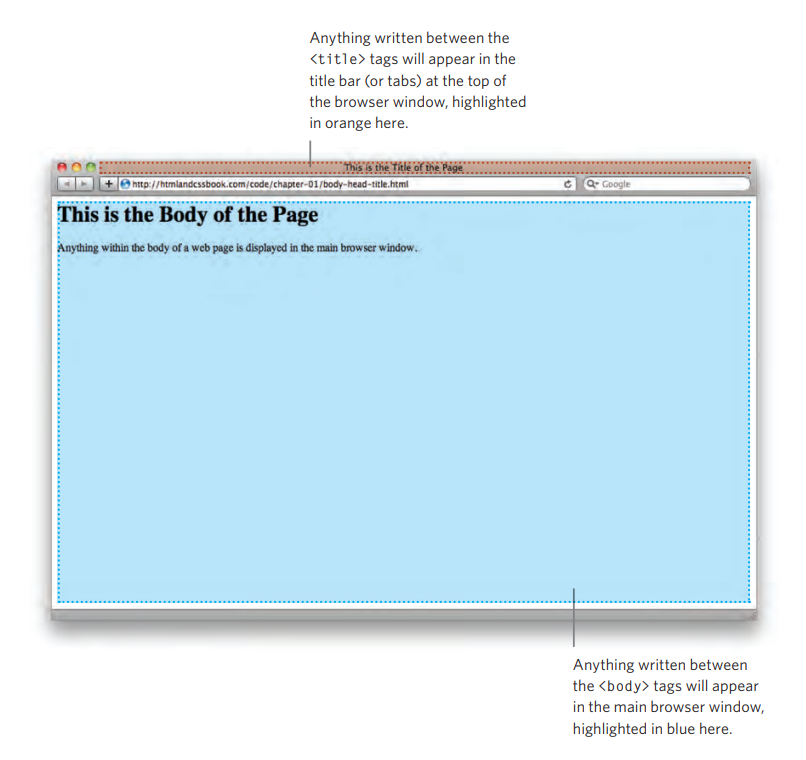

In HTML, the `<head>` and `<body>` tags are essential components of a web page.

1. `<head>` tag:
   - The `<head>` tag is used to provide **meta-information** and resources related to the document. It contains elements that define various aspects of the webpage but are not directly visible to users on the page itself.
   - Common elements found within the `<head>` tag include:
     - `<title>`: Sets the title of the webpage, which appears in the browser's title bar or tab.
     - `<meta>`: Provides metadata about the document, such as character encoding, author information, and keywords for SEO (Search Engine Optimization).
     - `<link>`: Links to external resources like CSS (Cascading Style Sheets) files or icon images.
     - `<script>`: Specifies scripts, such as JavaScript, used by the page.

2. `<body>` tag:
   - The `<body>` tag contains the **visible content** of the webpage that users see and interact with. It includes text, images, links, forms, and other HTML elements that form the main content of the page.
   - All elements within the `<body>` tag contribute to what is displayed in the browser window.
   - Example elements within the `<body>` tag include:
     - Headings: `<h1>`, `<h2>`, `<h3>`, etc.
     - Paragraphs: `
`
     - Images: ``
     - Links: `<a>`
     - Lists: `<ul>`, `<ol>`, `<li>`
     - Forms: `<form>`, `<input>`, `<button>`

The `<head>` and `<body>` tags work together to structure and present web content. The `<head>` tag contains important information about the document, while the `<body>` tag holds the visible content that users interact with. This separation helps browsers interpret and display web pages accurately while enabling developers to manage and optimize the overall presentation and functionality of the webpage.

In this step, we have utilized the `<title>` tag within the `<head>` tag.

The contents of the `<title>` element are displayed either at the top of the browser, above the area where users usually enter the URL of the page they want to visit, or on the tab representing that page (in case the browser employs tabs for viewing multiple pages simultaneously). The information specified within the `<title>` tag serves as the title of the webpage and provides users with an easily identifiable reference for the content they are currently viewing.

This is what you would see if you open the html file from this step in your browser.

