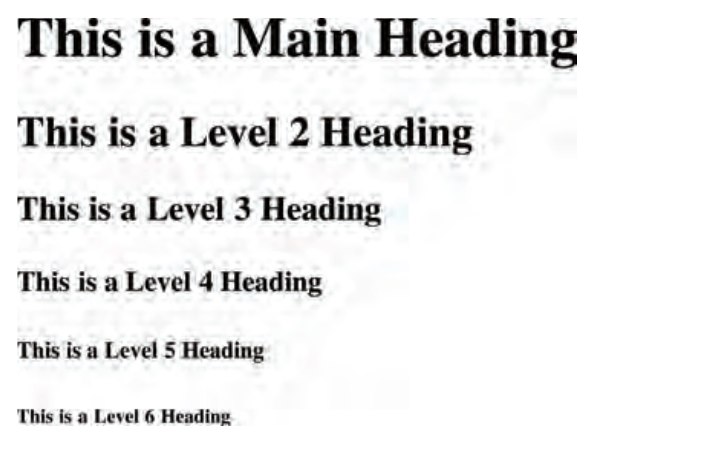

In HTML, heading tags are used to define headings or titles for different sections of a web page. They help in organizing and structuring the content, making it more accessible and user-friendly. HTML provides six levels of heading tags, ranging from `<h1>` to `<h6>`, where `<h1>` represents the highest level and `<h6>` the lowest level of headings.

1. `<h1>`: Main Heading
   - The `<h1>` tag is used to define the main heading or title of the page.
   - It should be used only once per page to represent the primary topic or subject matter of the page.
   - Search engines use the `<h1>` tag to understand the main focus of the page, so it is crucial for SEO.

    

2. `<h2>`: Subheading
   - The `<h2>` tag is used for subheadings that are directly related to the main heading.
   - It should be used for section titles or topics that fall under the main heading.

       

3. `<h3>`, `<h4>`, `<h5>`, `<h6>`: Subsequent Subheadings
   - The `<h3>` to `<h6>` tags are used for further subheadings or subsections of the content.
   - They indicate decreasing levels of importance and hierarchy in the content.

    

Using appropriate heading tags not only helps in structuring the content but also aids screen readers and search engines to understand the hierarchy and context of the information. It is essential to use heading tags in a meaningful and logical manner to create well-organized and accessible web pages.

Browsers display the contents of headings at different sizes. The contents of an `<h1>` element are the largest, and the contents of an `<h6>` element are the smallest. The exact size at which each browser shows the headings can vary slightly. Users can also adjust the size of text in their browser. You will see how to control the size of text, its color, and the fonts used when we come to look at CSS.

